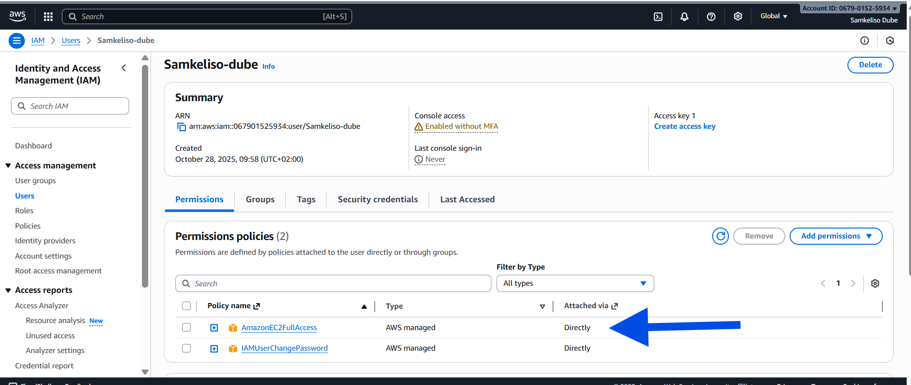
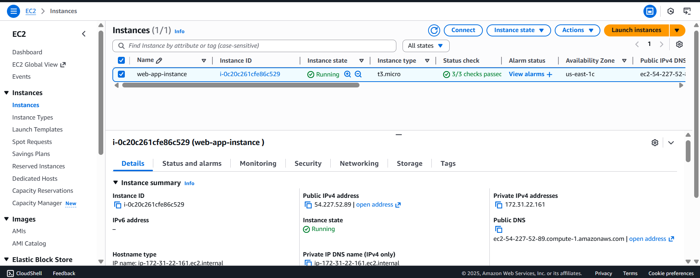
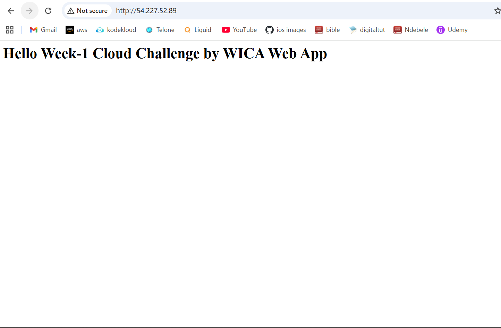
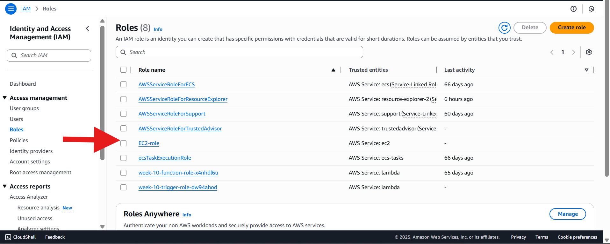

# Week-1 Cloud Challenge : Single-Instance Web App

This project is **Week 1** of the **12-Week AWS Workshop** and focuses on deploying a simple web application on a single EC2 instance. The app is publicly accessible and demonstrates the use of AWS fundamentals, IAM, and secure infrastructure setup.

---

## **Objectives**
- Understand AWS fundamentals and global infrastructure.
- Create IAM users and roles with secure permissions.
- Launch a t3.micro EC2 instance.
- Deploy a basic web application.
- Configure security groups (SSH & HTTP).
- Verify public access to the web application.

---

## **Tools**
- **Cloud Service**: AWS EC2  
- **Web Server**: Apache  
- **IAM**: AWS Identity and Access Management  
- **Libraries / Tools**: SSH for connection, AWS Management Console

---

## **Architecture Diagram**

Below is the architecture for the **Hello Cloud: Single-Instance Web App**:

> 

**Description:**
This setup demonstrates a single web server deployed in AWS:  
- The **User** connects via **SSH (port 22)** to manage the instance.  
- The **EC2 Apache Server** runs inside a **Public Subnet** within a **VPC (10.0.0.0/16)**.  
- The VPC is part of the **AWS Cloud Region** and connects to the internet through an **Internet Gateway** (implicit in the public subnet).  
- Security Groups control inbound access (SSH & HTTP).  


---

## **Getting Started**

### 1. Set up AWS Account and IAM User
1. Sign in to the [AWS Management Console](https://aws.amazon.com/console/).
2. Enable Multi-Factor Authentication (MFA) for the root account.
3. Create an IAM user (`cloud-user`) with **AWS Management Console access**.
4. Assign permissions: `AmazonEC2FullAccess`.
5. (Optional) Create a role for EC2 (`EC2WebAppRole`) if the app requires access to other AWS resources.

> Screenshot of IAM user dashboard:  
> 

---

### 2. Launch EC2 Instance
1. Navigate to **EC2 → Instances → Launch Instances**.
2. Choose AMI: Amazon Linux 2023 / Ubuntu 22.04 LTS.
3. Choose instance type: `t3.micro`.
4. Configure instance:
   - VPC: default or custom
   - Subnet: public
   - IAM Role: `EC2WebAppRole` (optional)
5. Add storage: default 8GB.
6. Add tags: `Name = HelloCloudApp`.
7. Configure security group:
   - SSH (22) → your IP
   - HTTP (80) → 0.0.0.0/0
8. Review and launch → download `.pem` key.

> Screenshot of EC2 instance dashboard:  
> 

---

### 3. Connect via SSH
```bash
chmod 400 HelloCloudKey.pem
ssh -i "HelloCloudKey.pem" ec2-user@<EC2-Public-IP>
```

# Update instance
```sudo yum update -y      # Amazon Linux
sudo apt update -y      # Ubuntu

# Install Apache
sudo yum install httpd -y     # Amazon Linux
sudo apt install apache2 -y   # Ubuntu

# Start web server
sudo systemctl start httpd    # Amazon Linux
sudo systemctl enable httpd
sudo systemctl start apache2  # Ubuntu
sudo systemctl enable apache2

# Create index.html
echo "<h1>Hello Week-1 Cloud Challenge by WICA Web App</h1>" | sudo tee /var/www/html/index.html
```

5. Verify Public Access
```
Open browser → http:// <EC2-Public-IP>
```
You should see: "Hello Week-1 Cloud Challenge by WICA Web App" ```


> Screenshot of EC2 instance dashboard:  
>   


6. Security & IAM Verification

Check security group rules → SSH & HTTP allowed.

  

Verify IAM users and roles exist and are properly configured.

 


Contribute

If you want to contribute, feel free to fork the repository, make improvements, and submit a pull request. Contributions are welcome whether it’s fixing documentation, adding features, or enhancing the project.

Conclusion

This project demonstrates deploying a single-instance web application on AWS with secure IAM configuration, EC2 setup, and public accessibility. It forms the foundation for learning more complex cloud architectures.


---


