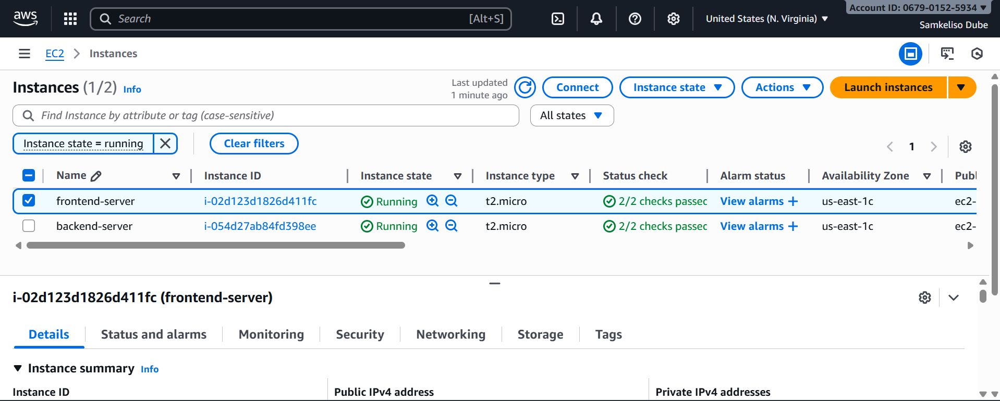
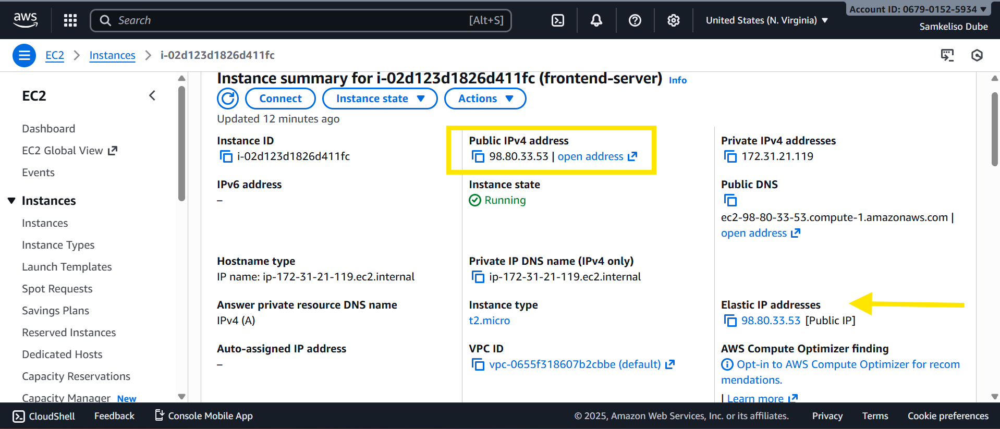
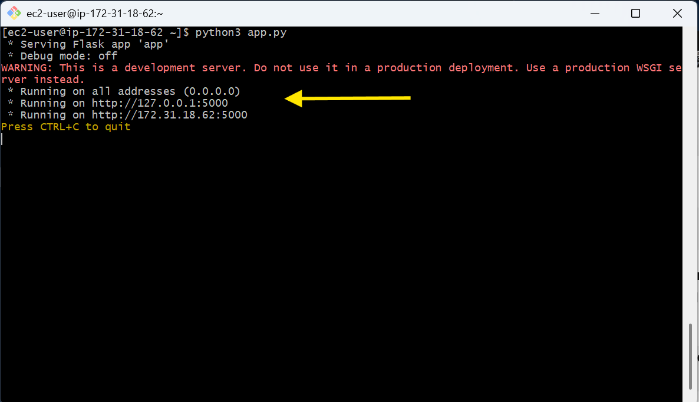
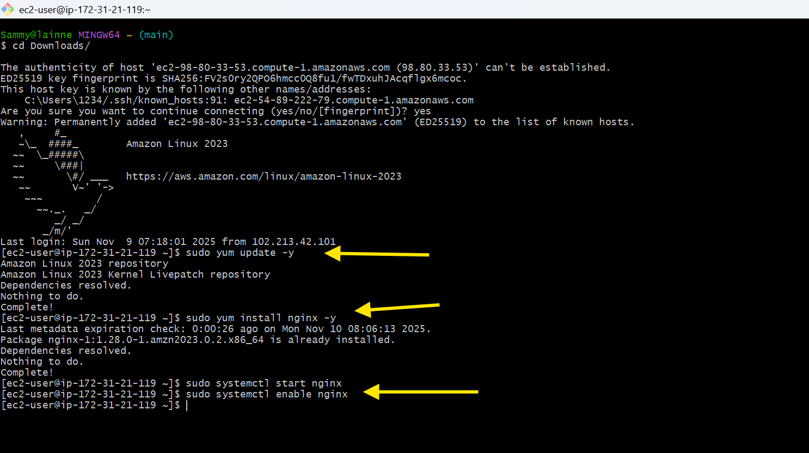
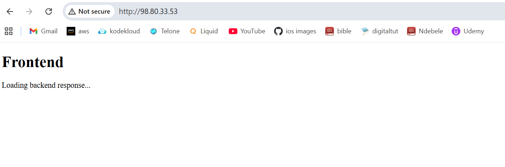

# Week 2: Multi-Tier App Deployment (EC2-based)

This project is **Week 2** of the **12-Week AWS Workshop** and focuses on deploying a **multi-tier web application** using EC2 instances. The app separates **frontend** and **backend**

---

## Objectives

1. Launch **frontend** and **backend EC2 instances**.  
2. Attach **Elastic IP** to frontend for consistent public access.  
3. Enable secure frontend-backend communication using **private IPs**.  
4. Implement security best practices using **Security Groups (SGs)** and IAM.

---

## Tools

- **Cloud Service:** AWS EC2  
- **Backend:** Python Flask  
- **Frontend:** Nginx + HTML / JavaScript  
- **Libraries / Tools:** SSH, AWS CLI

---

## Architecture Diagram

>   

**Description:**

- **User** interacts with **frontend EC2**.  
- **Frontend** communicates with **backend EC2** via private IP.  
- **Backend SG** allows inbound requests **only from frontend SG**, preventing external access.

---

## Step 1: Create EC2 Instances

### 1. Launch Backend EC2

1. Navigate to **EC2 → Instances → Launch Instance**.  
2. Choose **Amazon Linux 2 AMI**.  
3. Select **t2.micro** (free tier eligible).  
4. Configure network:  
   - Auto-assign Public IP: **No** (backend is private)  
5. Add storage: default (8 GB).  
6. Add tags: `Name = backend-server`.  
7. Configure **Security Group**:  
   - SSH (port 22) → your IP  
   - HTTP (port 5000) → source: **frontend SG**  
8. Review and launch → select or create **key pair** → Launch.

> 

---

### 2. Launch Frontend EC2

1. Navigate to **EC2 → Launch Instance**.  
2. Choose **Amazon Linux 2 AMI**.  
3. Select **t2.micro**.  
4. Configure network:  
   - Auto-assign Public IP: **Yes** (frontend needs public access)  
5. Add storage: default.  
6. Add tags: `Name = frontend-server`.  
7. Configure **Security Group**:  
   - SSH (port 22) → your IP  
   - HTTP (port 80) → anywhere (0.0.0.0/0)  
8. Review and launch → select key pair → Launch.

> 

---

## Step 2: Attach Elastic IP to Frontend

1. In AWS console: **EC2 → Elastic IPs → Allocate Elastic IP**  
2. Associate the Elastic IP with your **frontend instance**.  
3. Note the Elastic IP — this will be used to access frontend in a browser.

> 

---

## Step 3: Backend Setup (EC2)

### 1. Update instance and install Python/Flask
```bash
sudo yum update -y
sudo yum install python3 -y
sudo yum install python3-pip -y
pip3 install flask
```

#### 2. Create Flask app
 ```
   nano app.py
```
Paste:
```
from flask import Flask
app = Flask(__name__)

@app.route("/")
def home():
    return "Hello, this is the Backend API responding successfully!"

app.run(host="0.0.0.0", port=5000)

```


### 3. Run backend
```
python3 app.py

```

- Backend runs on port 5000.

- Ensure Backend SG allows TCP 5000 only from Frontend SG.



## Step 4: Frontend Setup (EC2)
### 1. Update instance and install Nginx
   
```
sudo yum update -y
sudo yum install nginx -y
sudo systemctl start nginx
sudo systemctl enable nginx

```


### 2. Verify Nginx

Open browser: http://frontend-elastic-ip

You should see the default Nginx welcome page.


### 3. Prepare frontend files
```
cd /usr/share/nginx/html
sudo rm -f index.html
sudo nano index.html

```
### 4. Frontend HTML/JS
```
<!DOCTYPE html>
<html>
<head>
    <title>Multi-Tier App</title>
</head>
<body>
    <h1>Frontend</h1>
    <p id="backend">Loading backend response...</p>

    <script>
        fetch("http://<backend-private-ip>:5000")
        .then(response => response.text())
        .then(data => {
            document.getElementById("backend").innerText = "Backend says: " + data;
        })
        .catch(err => {
            document.getElementById("backend").innerText = "Error connecting to backend";
        });
    </script>
</body>
</html>

```
### 5.Replace <backend-private-ip> with backend EC2 private IP.


```
press ctrl+x
press y
press enter

to exit
```
### 6. Access frontend

Open browser: http://frontend-elastic-ip




Important: Since the backend is private, you cannot see the backend message in your browser. This is by design — the frontend can reach the backend only within the VPC.

### Test from Frontend EC2:

#### 1.SSH into frontend EC2:
```
ssh -i <your-key>.pem ec2-user@<frontend-elastic-ip>

```
#### 2.Use curl to verify backend connectivity:
```
curl http://<backend-private-ip>:5000/

```
Expected output:
```
Hello, this is the Backend API responding successfully!

```
   


#### Security Groups

Backend SG: allow port 5000 only from Frontend SG → prevents external users from accessing backend.
- Frontend SG: allow port 80/443 from anywhere.

- SSH (22) access restricted to your IP for both instances.

### Challenges & Learnings

- Configuring EC2-to-EC2 communication with private IPs.

- Using Frontend SG to restrict backend access → security best practice.

### Future Improvements

- Add RDS database tier for persistent storage.

- Enable HTTPS for secure communication.

- Implement auto-scaling for high availability.
- Optional: Deploy Backend Using Elastic Beanstalk


#### Contribute

Fork the repository, improve documentation, or submit pull requests for frontend/backend features or optional EB deployment.

#### Conclusion

This project demonstrates multi-tier web app deployment with EC2 backend and frontend, enforcing security using frontend SG for backend access. Elastic Beanstalk deployment is optional for scalability.

Key Note: You cannot see backend responses in your browser because it runs on a private IP. Use curl from frontend EC2 to verify communication


